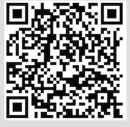

# 自我介绍

大家好，我是<strong>子颢</strong>，一个普通的机器学习和深度学习算法开发程序猿。我12年毕业于武汉大学，大学的专业是软件工程，毕业后先后去了迅雷和百度从事数据开发方面的工作，16年到18年在阿里巴巴从事机器学习和深度学习相关的算法研究，18年9月份将加入腾讯继续在NLP领域深耕。

从毕业到现在，历经两次转型，每一次转型对于我而言都是非常大的挑战，全靠自己摸索，中间也走了很多弯路，好在最终结果还算成功。所以我想把自己的一些经验分享给大家，希望能对需要的人有所帮助。

工作的这些年来，也渐渐形成了自己的职业发展观。与其说是转型，不如说是对自己职业发展的布局。商业->业务->工程->数据->算法，算法最终推动商业价值，形成完整闭环。随着职业的发展，我们应该站在不同的高度去思考问题。

在机器学习和深度学习领域，学术界和工业界其实存在相当大的gap。在工业界，不仅要求搞懂算法模型的原理和理论，还要求算法模型的开发实现和训练，以及模型的上线部署和优化，模型优化除了包括模型预测效果的优化，其实还包括模型、算法的性能优化，最终达到上线标准。

再此声明，本次以及今后的一系列分享课程纯属公益性质，不带任何商业目的，纯粹是想和大家分享自己在工业界摸爬滚打的这些年的经验总结，希望能够尽量缩小机器学习和深度学习领域学术界到工业界过度的gap，让我们的算法模型真正在实际的工作中变现，实现商业价值。

# 课程大纲

本系列课程主要包括机器学习和深度学习两大部分，除了会循序渐进由易到难的介绍算法模型的原理和理论，主要还会介绍模型的实现和训练，以及模型的上线和调优。最重要的是会结合实际工作中的例子，让大家明白各种算法模型到底是如何在实际工作中落地和产出价值的。

课程通过文字和视频的形式，每个视频大概二十到四十分钟，推荐大家按照我的课程进度来，不要光看视频，尽量弄懂每一行代码，并能够在我的基础上进行修改和改进。本系列课程对读者没有太多要求，但需要有一些数学基础和基本的代码能力。

- 机器学习
	- K近邻算法
	- 决策树
	- 随机森林
	- AdaBoost
	- GBDT
	- 朴素贝叶斯
	- 逻辑回归
	- SVM
	- 最大熵模型
	- 机器学习模型部署及在线预测
- 深度学习
	- 全连接神经网络
	- 卷积神经网络
	- 循环神经网络
	- hierarchical CNN 分层卷积神经网络
	- NER 命名实体识别
	- Attention机制
	- Attention based CNN在QQ match中的应用
	- 深度学习模型部署及在线预测
- 迁移学习
	- multi-task NER和分类的多任务迁移学习
	- 基于多语言分类的迁移学习
	- zero shot & few shot
- 生成模型
	- seq2seq
	- GAN 生成对抗网络
- 强化学习
	- seqGAN 基于GAN和强化学习的文本生成模型

# 社群

- QQ交流群
	
- 微信交流群
	
- 微信公众号
	